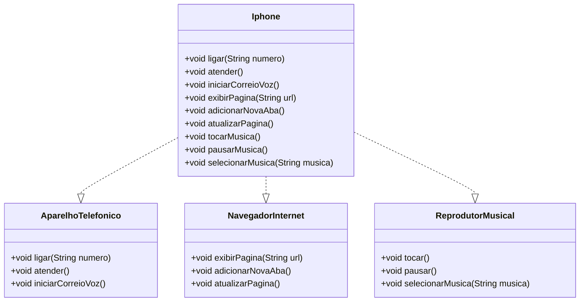

 
  [](https://git.io/typing-svg)<br>

  
   <br>

# 📱 Projeto iPhone  

✔️ Este repositório contém a implementação de um modelo de iPhone em Java, incluindo funcionalidades de telefone, navegador e reprodutor musical.

## 📂 Estrutura do Projeto

| Diretório / Arquivo                      | Descrição |
|------------------------------------------|-----------|
| `.github/workflows/java.yml`             |🔧 Configuração do GitHub Actions para CI/CD |
| `src/main/java/br/com/iphone/application/` |📁 Código-fonte principal do projeto |
| ├── `Iphone.java`                         |💻 Classe principal que integra todas as funcionalidades |
| ├── `AparelhoTelefonico.java`            | 📞 Classe responsável por funções telefônicas |
| ├── `NavegadorInternet.java`             |🌐 Classe responsável por navegação na web |
| ├── `ReprodutorMusical.java`             |🎵 Classe responsável pela reprodução de músicas |
| `src/test/java/br/com/iphone/`           |✅ Testes unitários do projeto |
| ├── `IphoneTest.java`                    |🧪 Classe de testes para validar as funcionalidades |
| `.gitignore`                              |🗑️ Arquivo para ignorar arquivos desnecessários no Git |
| `README.md`                               |📚 Documentação do projeto |
| `LICENSE`                                      | 📜 Licença do projeto                            |

## 🚀 Funcionalidades

### 📞 Aparelho Telefônico
- `ligar(String numero)`: Realiza uma ligação para o número informado.
- `atender()`: Atende uma chamada.
- `iniciarCorreioVoz()`: Inicia o correio de voz.

### 🌐 Navegador de Internet
- `exibirPagina(String url)`: Exibe a página informada.
- `adicionarNovaAba()`: Adiciona uma nova aba ao navegador.
- `atualizarPagina()`: Atualiza a página atual.

### 🎵 Reprodutor Musical
- `tocar()`: Inicia a reprodução de música.
- `pausar()`: Pausa a música em execução.
- `selecionarMusica(String musica)`: Seleciona uma música específica.

## 🛠️ Tecnologias Utilizadas

- **Linguagem**: Java 17 ☕
- **Gerenciamento de Versão**: Git & GitHub 📌
- **Integração Contínua**: GitHub Actions ⚙️

## 📜 Diagrama de Classes



## 🏗️ Como Executar o Projeto

1. Clone o repositório:
   ```bash
   git clone https://github.com/seu-usuario/seu-repositorio.git
   cd seu-repositorio
   ```
2. Compile os arquivos Java:
   ```bash
   javac -d out src/main/java/br/com/iphone/application/*.java src/test/java/br/com/iphone/*.java
   ```
3. Execute o teste:
   ```bash
   java -cp out br.com.iphone.iphoneTest
   ```

## 📌 Melhorias Futuras
- Implementação de testes unitários mais detalhados
- Adição de interface gráfica para simulação de um iPhone
- Melhorias na estrutura e encapsulamento das classes

---

💡 **Contribua!** Caso tenha sugestões ou melhorias, sinta-se à vontade para abrir um Pull Request. 🚀

## 👨‍💻 Autor

<p>
    
    <p>&nbsp&nbsp&nbspLilianBR<br>
    &nbsp&nbsp&nbsp
    <a 
        href="https://github.com/LiliBR-tech">
        GitHub
    </a>
    &nbsp;|&nbsp;
    <a 
        href="https://www.linkedin.com/">
        LinkedIn
    </a>
    &nbsp;|&nbsp;
    <a 
        href="https://www.instagram.com/">
        Instagram
    </a>
    &nbsp;|&nbsp;</p>
</p>
<br/><br/>
<p>


---
